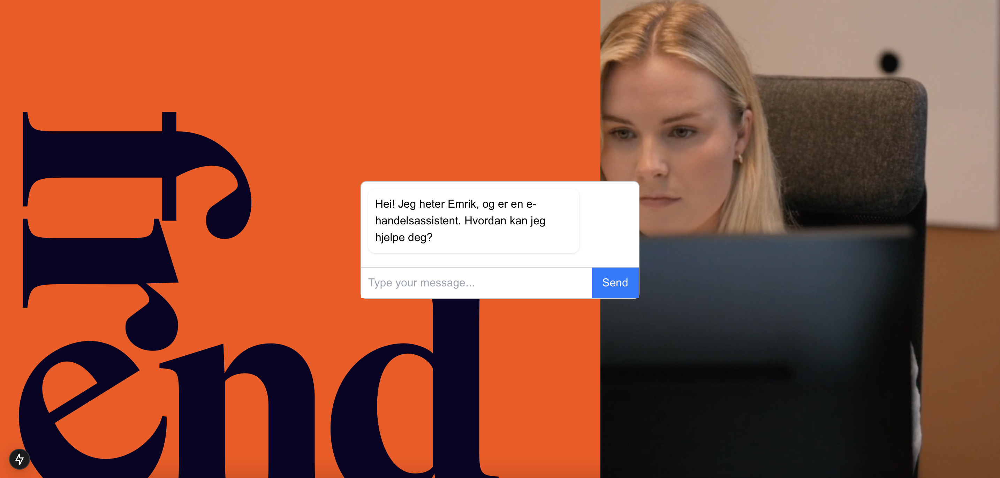
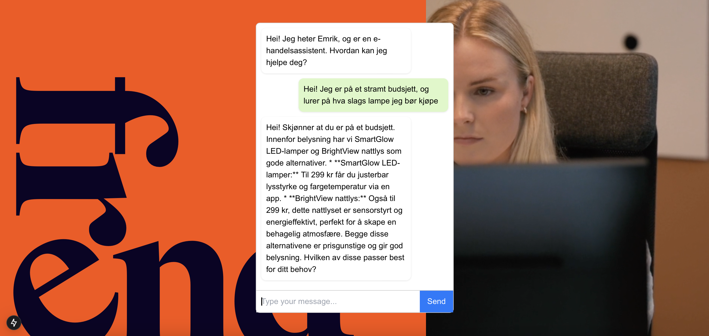

# ai_mate
## Frend Digital Hackathon Project - AI Chatbot for Appliance Store

A project developed during a 2-hour hackathon organized by Frend Digital in Oslo.

### Project Overview

This repository contains our AI chatbot solution designed to assist customers of an appliance store. The chatbot was developed with limited time constraints (2 hours) using a provided dataset.

### Features

- AI-powered customer service assistant
- Product recommendations based on customer queries
- Information retrieval about appliance specifications
- Troubleshooting guidance for common appliance issues

### Technologies Used

- Next.js for the frontend framework
- Tailwind CSS for styling
- Natural Language Processing (NLP)
- OpenAI API for AI capabilities
- React for UI components
- JavaScript/TypeScript

### Challenges

Working within the 2-hour time constraint while implementing an effective AI solution that could properly utilize the provided dataset.

### Future Improvements

Ideas for extending the project beyond the hackathon:
- Enhanced product matching algorithms
- Expanded knowledge base
- Improved conversation handling
- Integration with e-commerce platforms